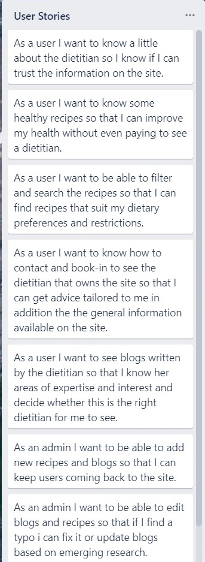
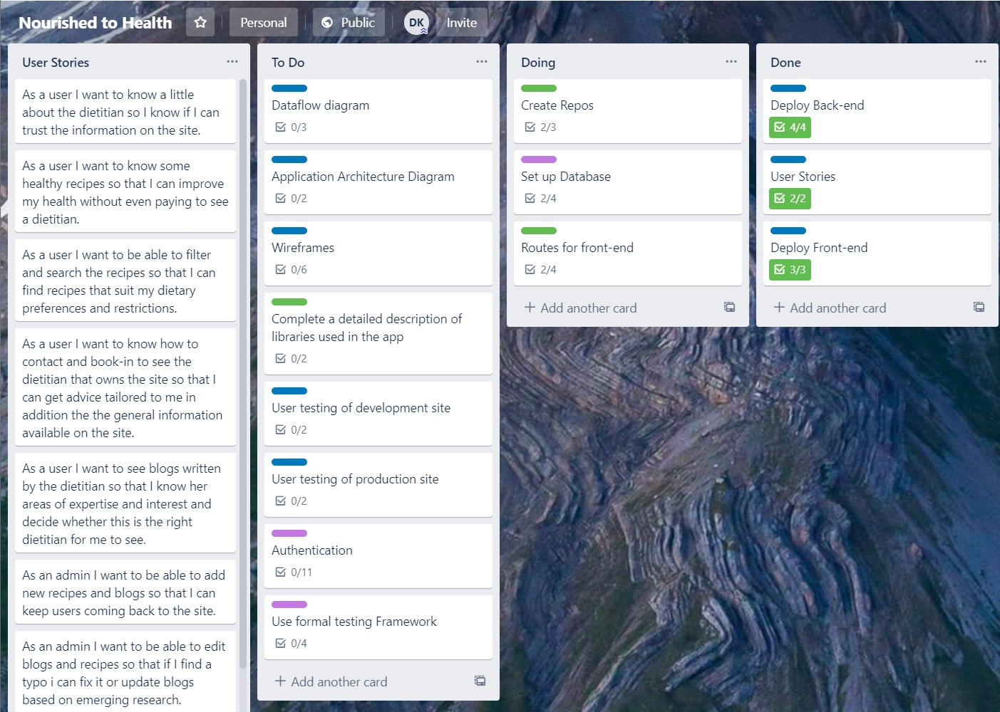

## Purpose
The purpose of the application is to provide a business website for a dietitian.  Useful information will be available on the site to encourage visitors to get in contact with the dietitian and book in for an appointment.  
## Functionality
The site will clearly display the dietitian’s qualifications and areas of expertise.  Healthy recipes will be available to meet the requirements of individuals with different goals.  Recipes will be filterable by category.  All recipes will be stored on a database connected to the back-end server.  Users will also be able to read blog posts from the dietitian.  These are also stored on the database.  An admin will be able to log into the site and create new, update and delete any recipes or blogs.
## Target Audience
The target audience is anyone that would benefit from seeing a diet.  Those looking to change body composition, loose weight, increate energy or manage disease would all be able to find something on the site to suit them and consequently get in touch with the dietitian for personalised input.
## Tech Stack
* MongoDB – Database
* Express.js – Back-end server
* React.js – Front-end
* Node.js – Back-end JS runtime
* Netlify – Front-end cloud hosting
* Heroku – Back-end cloud hosting
* MongoDB Atlas – Database cloud hosting
## Dataflow Diagram

## Application Architecture Diagram

## User Stories
[Trello](https://trello.com/b/csa9MK4B/nourished-to-health)

## Wireframes

## Trello
[Trello](https://trello.com/b/csa9MK4B/nourished-to-health)
